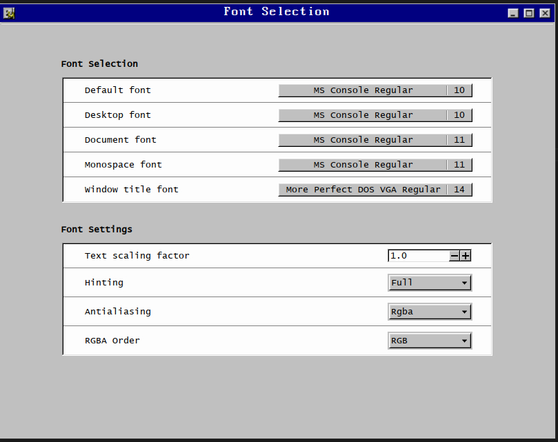

# Chicago95 Theme patch for Cinnamon 6.6.7

Work in progress :)

[Chicago95](https://github.com/grassmunk/Chicago95) is an XFCE theme, but I like Cinnamon. Luckily it mostly works on Cinnamon. This repo aims to patch up some weird / broken stuff you get when trying to combine cinnamon and chicago95.

## Install

Will make an installer script in the future. For now:
- `mkdir -p ~/.local/share/fonts`
- `cp fonts/* ~/.local/share/fonts`
- `sudo fc-cache -f -v` 
- append the contents of `cinnamon.css` to `~/.themes/Chicago95/cinnamon.cinnamon.css`
- `cinnamon --replace &`
- `reboot`
- Set the system fonts: 
