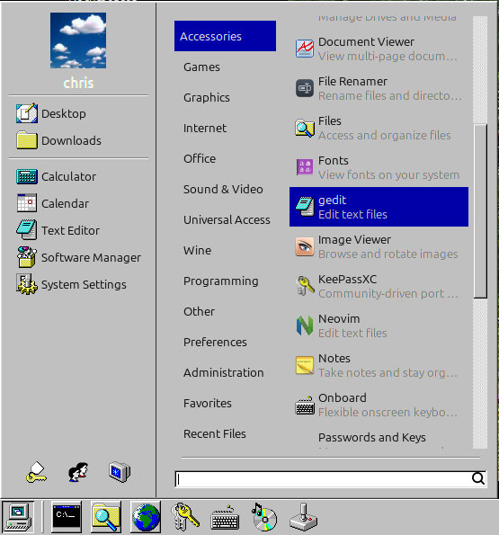

# Chicago95 Theme patch for Cinnamon 6.6.7

Work in progress :)

[Chicago95](https://github.com/grassmunk/Chicago95) is an XFCE theme, but I like Cinnamon. Luckily it mostly works on Cinnamon. This repo aims to patch up some weird / broken stuff you get when trying to combine cinnamon and chicago95.

